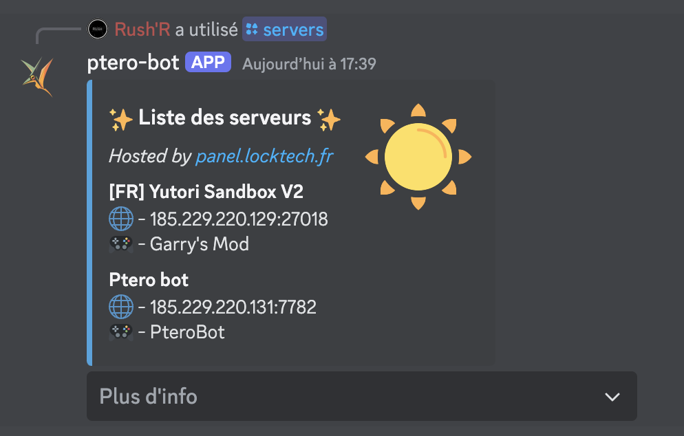
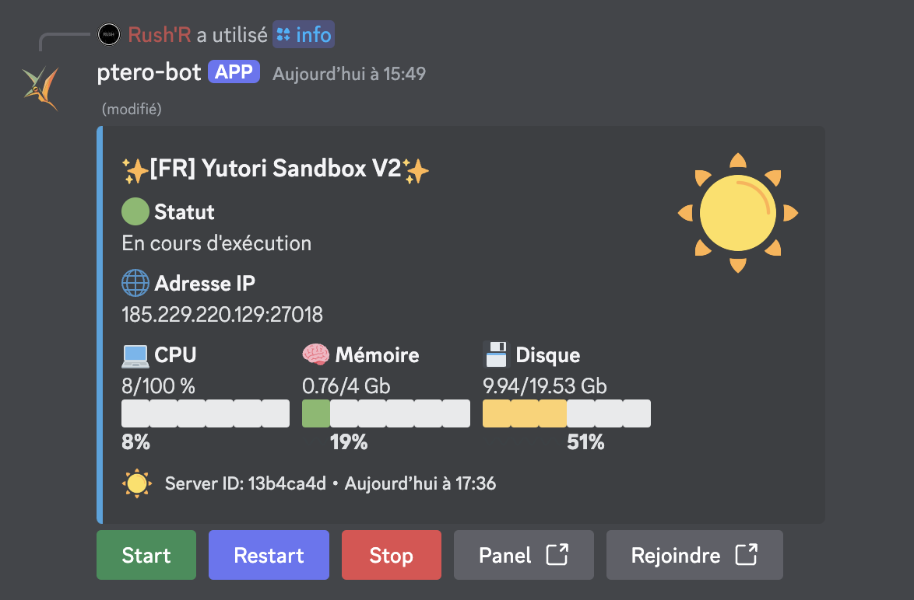
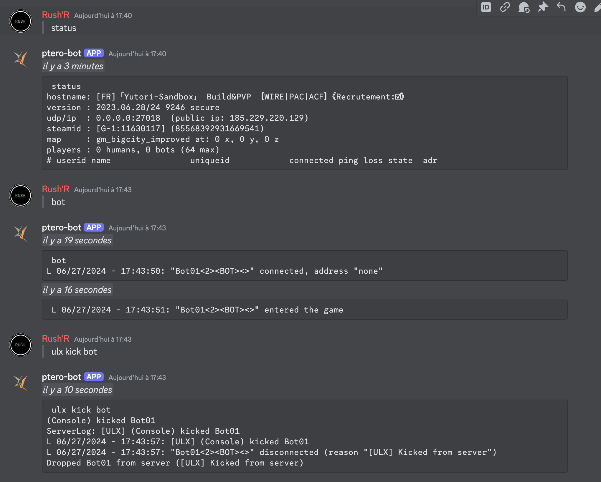
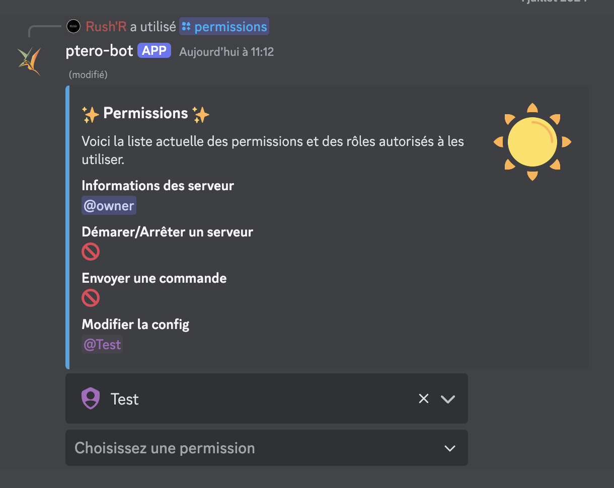

# Ptero bot

# What is Ptero bot?
Ptero bot is a discord bot that is designed to help you manage your pterodactyl panel. It is designed to be easy to use and easy to setup.

## Features
### List servers
  List all your servers with the command `/servers`
  [](./doc/images/list-servers.png)
### get server information
  Get information about a server with the command `/info server:<server_id>` 
  you can start / stop / restart the server with the buttons
  [](./doc/images/server-info.png)

### connect a channel with the server console
  Connect a channel with the server console with the command `/console_channel server:<server_id>`

  you can send commands to the server by typing `> ` before the command all log will be sent to the channel
  [](./doc/images/console-channel.png)

### manage bot permissions
  You can manage the bot permissions with the command `/permissions`

  [](./doc/images/permissions.png)

# a public instance is available here:
[discord link](https://discord.com/oauth2/authorize?client_id=1253298808528572426)

# running the bot

- with Pterodactyl import the egg: [egg-ptero-bot.json](./egg-ptero-bot.json)

# How do I setup Ptero bot on my own?

- install docker
- configure the .env file with the correct values exemple: 
  ```env
    DISCORD_TOKEN=your_discord_token
    DISCORD_CLIENT_ID=your_discord_client_id
    DATABASE_URL="mysql://root:root@db:3306/ptero-bot"
  ```
- run `docker compose up -d`
- create prisma database with `docker-compose exec node npx prisma migrate dev`
- done !